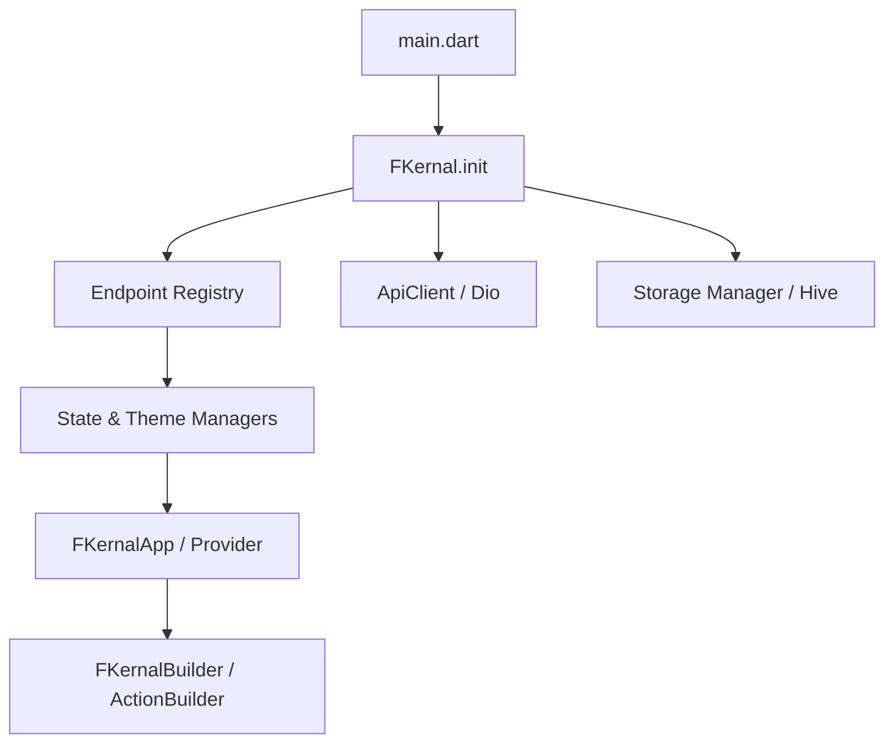

# FKernal 🚀

**The Configuration-Driven Flutter Kernal**

FKernal is a high-level, opinionated framework designed to accelerate Flutter development by shifting the focus from imperative boilerplate to declarative configuration. It provides a unified orchestration layer for **Networking, State Management, Local Storage, Error Handling, and Theming**.

---

## 📖 Table of Contents
- [Architecture Overview](#-architecture-overview)
- [Installation](#-installation)
- [Core Configuration](#-core-configuration)
  - [FKernalConfig](#fkernalconfig)
  - [Environment Management](#environment-management)
  - [Feature Flags](#feature-flags)
- [Declarative Networking](#-declarative-networking)
  - [Endpoint Definition](#endpoint-definition)
  - [Path & Query Parameters](#path--query-parameters)
  - [Interceptors & Headers](#interceptors--headers)
- [State Management Deep Dive](#-state-management-deep-dive)
  - [Resource States (API)](#resource-states-api)
  - [Local State Slices (UI)](#local-state-slices-ui)
- [Theming System](#-theming-system)
- [Persistence & Caching](#-persistence--caching)
- [Error Handling & Resilience](#-error-handling--resilience)
- [Widget Reference](#-widget-reference)
- [Extension Library](#-extension-library)

---

## 🏗 Architecture Overview

FKernal follows a **Configuration-First** philosophy. You define the "What" (API structure, branding tokens), and the framework handles the "How" (State transitions, caching logic, error recovery).



---

## 🚀 Installation

Add FKernal to your `pubspec.yaml`:

```yaml
dependencies:
  fkernal: ^1.0.0
```

---

## ⚙️ Core Configuration

### FKernalConfig
The central nerve center of your application.

```dart
const config = FKernalConfig(
  baseUrl: 'https://api.myapp.com',
  environment: Environment.production,
  connectTimeout: 15000,
  features: FeatureFlags(
    enableCache: true,
    enableAutoRetry: true,
  ),
  theme: ThemeConfig(
    primaryColor: Colors.deepPurple,
    useMaterial3: true,
  ),
);
```

### Environment Management
FKernal uses the `Environment` enum to control internal behavior:
- `development`: Verbose logging, detailed error messages.
- `staging`: Controlled logging, sanitized errors.
- `production`: Logging disabled, user-friendly error masks.

---

## 📡 Declarative Networking

### Endpoint Definition
Endpoints are defined as immutable `Endpoint` objects. This allows the framework to pre-register routes and optimize state generation.

```dart
final endpoints = [
  Endpoint(
    id: 'getProfile',
    path: '/me',
    method: HttpMethod.get,
    cacheConfig: CacheConfig.long, // Cache for 1 hour
  ),
  Endpoint(
    id: 'updateAvatar',
    path: '/me/avatar',
    method: HttpMethod.post,
    invalidates: ['getProfile'], // Clear profile cache on success
  ),
];
```

### Path & Query Parameters
FKernal automatically parses path variables using the `{paramName}` syntax.

```dart
// Definition
Endpoint(id: 'getPost', path: '/posts/{postId}')

// Usage in UI
FKernalBuilder(
  resource: 'getPost',
  pathParams: {'postId': '42'},
)
```

---

## 🔄 State Management Deep Dive

### Resource States (API)
The `ResourceState<T>` sealed class ensures your UI is always in a predictable state.

| State | Purpose | Properties |
| :--- | :--- | :--- |
| `ResourceInitial` | Idle state. | - |
| `ResourceLoading` | Network call active. | `previousData` (for smooth refreshes) |
| `ResourceData` | Data retrieved. | `data`, `fetchedAt`, `fromCache` |
| `ResourceError` | Request failed. | `error` (FKernalError), `previousData` |

**Mapping States:**
```dart
state.when(
  loading: () => Spinner(),
  onData: (data) => ListUI(data),
  onError: (error) => ErrorUI(error),
);
```

### Local State Slices (UI)
Manage ephemeral state like form inputs or interactive counters using optimized slices.

- `CounterSlice`: Pre-built methods for `increment()` and `decrement()`.
- `ToggleSlice`: Lightweight boolean wrapper with `toggle()`.
- `ListSlice<T>`: Collection manager with built-in history/undo support.

---

## 🎨 Theming System
Define your design tokens once in `ThemeConfig`. FKernal automatically generates consistent `ThemeData` for both Light and Dark modes, ensuring accessibility and Material 3 compliance.

```dart
final theme = ThemeConfig(
  primaryColor: Color(0xFF1E88E5),
  borderRadius: 12.0,
  fontFamily: 'Outfit',
);

// Access in UI
final primary = context.theme.colorScheme.primary;
```

---

## 💾 Persistence & Caching
Powered by **Hive**, FKernal provides a high-performance binary storage engine.
- **TTL Caching**: Define exact durations for how long data should live.
- **Stale-While-Revalidate**: Return cached data immediately while fetching fresh data in the background.
- **Secure Storage**: Integration for sensitive credentials via `flutter_secure_storage`.

---

## 🧱 Widget Reference

### FKernalBuilder
The reactive bridge between your API and the UI.

```dart
FKernalBuilder<User>(
  resource: 'getUser',
  pathParams: {'id': '1'},
  autoFetch: true, // Fetch immediately on mount
  builder: (context, user) => ProfileHeader(user),
)
```

### FKernalActionBuilder
A specialized builder for mutations that provides a `perform` callback.

```dart
FKernalActionBuilder<void>(
  action: 'deletePost',
  showSuccessSnackbar: true,
  builder: (context, perform, state) => IconButton(
    onPressed: state.isLoading ? null : () => perform(null),
    icon: Icon(Icons.delete),
  ),
)
```

---

## 📊 Extension Library
The framework provides comprehensive `BuildContext` extensions for zero-boilerplate access to services.

| Extension | Return Type | Description |
| :--- | :--- | :--- |
| `context.stateManager` | `StateManager` | Global state orchestration. |
| `context.apiClient` | `ApiClient` | Direct Dio access. |
| `context.themeManager` | `ThemeManager` | Dynamic theme switching. |
| `context.localState<T>(id)` | `T` | Current value of a local slice. |
| `context.updateLocal<T>(id, fn)` | `void` | Update a local state slice. |
| `context.fetchResource(id)` | `Future<T>` | Imperative API fetch. |

---

## 🚀 Pro Tips
- **Pre-loading**: Call `context.fetchResource('id')` during splash screens to warm up the cache.
- **Selective Invalidation**: Use the `invalidates` list in `Endpoint` config to keep your UI in sync without manual refreshes.
- **Custom Parsing**: Use the `parser` property in `Endpoint` to convert raw JSON into complex objects using `json_serializable`.

---

## 📜 License
FKernal is released under the MIT License. Built with ❤️ for the Flutter community.
